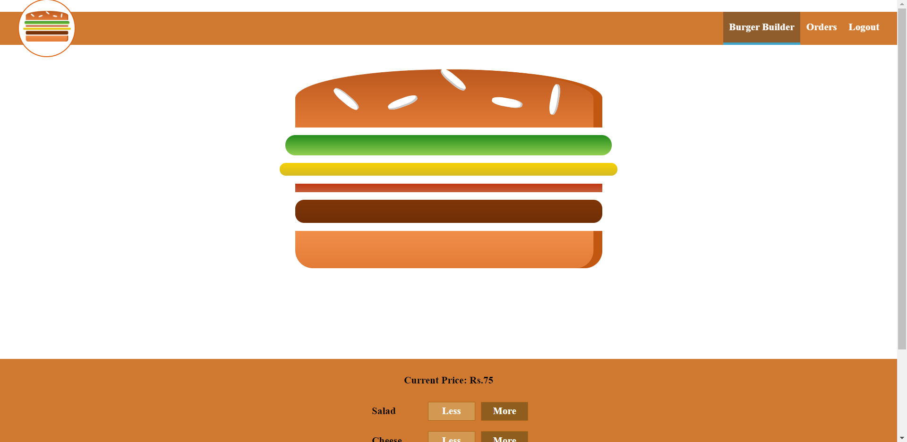
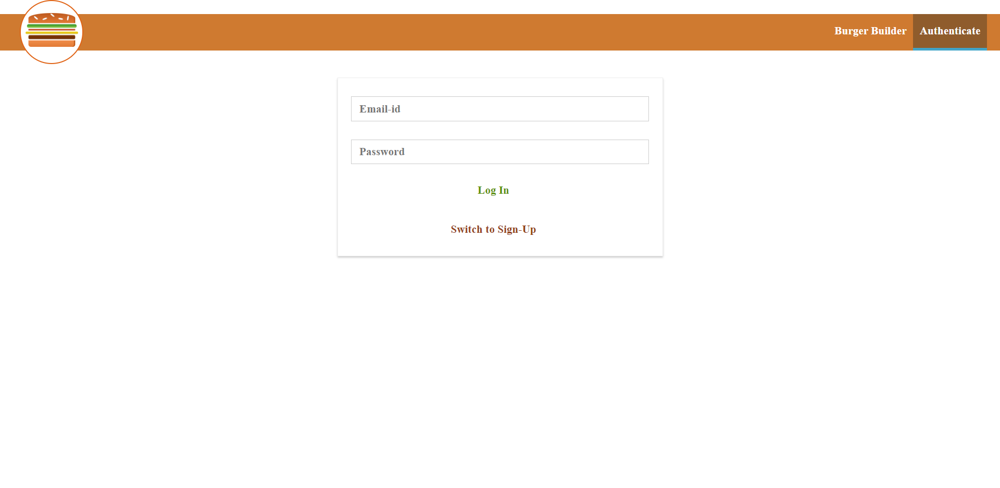
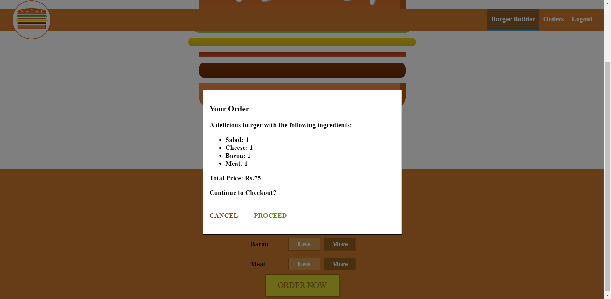
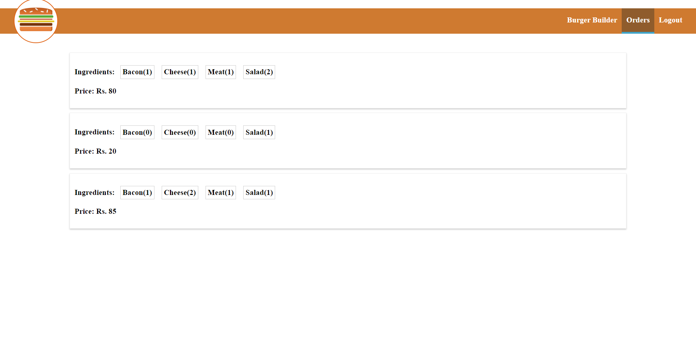
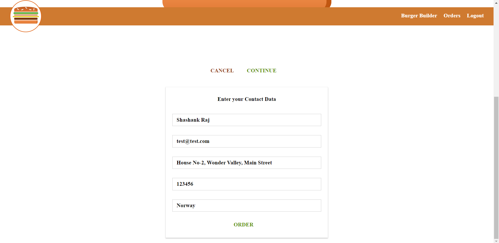

# Burger Ordering App

This application allows authenticated user to order burger of their choice with various ingredients.
User can also view their previous orders.

## Tech Stack

- Front-end: ReactJS, HTML, CSS
- Back-end and Database: Axios and Firebase

## Run Locally

Clone the project

```bash
  git clone https://github.com/srj1107/BuildUrBurger
```

Go to the project directory

```bash
  cd BuildUrBurger
```

Install dependencies

```bash
  npm install
```

Start the front-end

```bash
  npm start
```

## Screenshots

---

#### Landing Page



---

#### Login Page



---

#### Confirmation Page



---

#### Orders Page



---

#### Checkout Page


